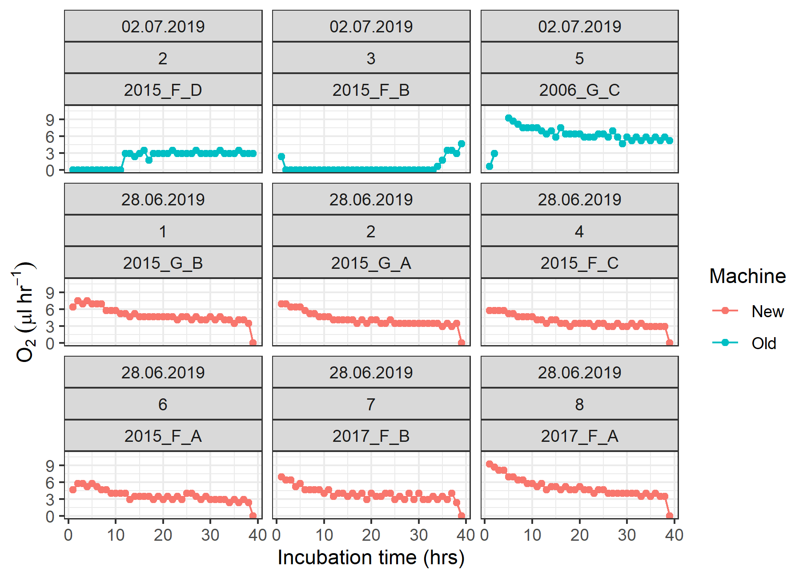

```{r setup, include=FALSE}
knitr::opts_chunk$set(echo = TRUE)
```
```{r, echo=FALSE, message=FALSE, warning=FALSE}
# pacakages required for making pdf document
# packages
library("dplyr", lib.loc="~/R/win-library/3.5")
library("tidyr", lib.loc="~/R/win-library/3.5") 
library("purrr", lib.loc="~/R/win-library/3.5")
library("ggplot2", lib.loc="~/R/win-library/3.5")

```

In this section you will learn how to automate data import and graph making by creating functions, using the map function and lists.  

# purrr::map

## Apply a function to each element of a vector


```{r}
# create a vector of 5 integers
n <- c(6, 3, 7, 2, 10)

```

You want to add 1 and substract 1 from each number


```{r}
# vector for + and - 1
m <- c(1, -1)

```

What happens when you try n + m?

```{r}
n + m

```

Essentially what happened was: 

n[1] + m[1], n[2] + m[2], n[3] + m[1], n[4] + m[2], n[5] + m[1]

As m is a shorter vector than n, the elements of m get repeated. This is not the outcome we wanted. 


The map functions in the purrr transform their input by applying a function to each element and returning a vector the same length as the input.

```{r, eval = F}
library(purrr)
```
```{r, eval = T}
map(m, ~ n + .) # '.' is a placeholder
```

When the output is saved, R automatically saves both vectors within a list: 
```{r, eval = F}
x <- map(m, ~ n + .)
```

# Lists

[Note from Jess: I need to think of a good explanation about lists. Basically lists store all kinds of objects within the shell of one object within the environment. You can have a list which consists of all identical length vectors or identical length dataframes, or all non-identical vectors and dataframes, or a mixture of dataframes and vectors. Just look at the lists which are created when you save the output of a linear model

An advantage is that you can apply a function to each element of your list.]

```{r, eval = F}
x.1 <- map(x, ~ .^2) # square each element
x.2 <- map(x, ~ mean(.)) # calculate the mean of each vector
```


# Functions

You can create a function to perform anything you like: 
```{r, eval = T}

# square a number
fun1 <- function(x){
  x^2
}

fun1(4) # when x = 4

# for many numbers
fun1(n)
```

## Using functions in conjunction with map
```{r, eval = F}
y <- map(n, ~fun1(.)) # use the function you created

x.2 <- map(x, ~ mean(.)) # use existing functions such a mean 
```

[This might seem a bit complicated for such simple tasks but it will come clearer why it is useful later] 


# Automated data import

## To merge all files into one dataframe: map_df from purrr


```{r, eval = F}

# Create a list with the names of all files you wish to import into your environment
files_names <- list.files("File_path/", pattern = "*.csv")

# (this only works if the tables have identical column names and dimensions)
All_data <- map_df(files, ~read.csv(paste0("File_path/", .)))

```

## Alternatively work using lists

When your data are not identical in dimensions or file names, it might be better to import the data to a list.

```{r, eval = F}
# first define an empty list
My.list <- list()

# use the read.csv function with map to store each file as a separate data frame within your list
My.list <- map(files, ~ read.csv(paste0("File_path/", .)))

# access each df from list 
My.list[[1]]

# name each dataframe with the file name
names(My.list) <- files 

My.list[["Filename1.csv"]]
```` 

### Data manipulation accross all dataframes in the list 

Tidyr and dplyr are especially useful here

```{r, eval = F}

library(dplyr)
library(tidyr)


# E.g create a new column with changed date format
My.list.2 <- map(My.list, ~mutate(.x, New_Date.format = as.Date(Date,  format = "%d.%m.%Y"))) 

# Delete a column , e.g. a comments column
My.list.2 <- map(My.list2, ~ select(.x, -Comments))

# Perform many operations using the pipe function

My.list.2 <- My.list %>% 
  map(~mutate(., O2.L = O2_ml/1000)) %>% # change units from ml to L
  map(~select(., -c(Channel, Treatment))) # remove columns
```


# Graph functions

For graph automation using functions, map and ggplot2

## A function for graphs with a common x axis
```{r, eval = F}
library(ggplot2)

# define which columns you want to plot against x
vars <- names(My.data)[5:10]

# make a function with ggplot where y is the placeholder for your y variable:
fun1.1 <- function(y) { 
  My.data %>% 
    ggplot() + 
    aes(Date, get(y), col = Land.use) + #get(y) removes "" from the variable name
    geom_point() + 
    theme_bw() + 
    xlab("Date") + 
    ylab(y) # don't forget to label axis
}

# map passes each element of the vars vector through the graph function as y
# and thus creates a separate graph for each variable that you defined
map(vars, fun1.1)
```

## A function for subsetting data and creating graph for each treatment level

```{r, eval = F}
# create a vector for soil type:
ST.filter = levels(My.data$Soiltype)

# e.g. 
fun2 <- function(x) { 
  My.data %>% 
    filter(Soiltype == x) # x is the placeholder for the soil type level
    ggplot() + 
    aes(Date, Total.carbon , col = Land.use) + 
    geom_point() + 
    theme_bw() + 
    xlab("Date") + 
    ggtitle(x) # don't forget to make a title so you know which soil type is being shown
}
map(ST.filter, fun2)
````

## Save the graphs to your computer

Use ggsave()

```{r, eval = F}
fun2 <- function(x) { 
  My.data %>% 
    filter(Soiltype == x) # x is the placeholder for the soil type level
    ggplot() + 
    aes(Date, Total.carbon , col = Land.use) + 
    geom_point() + 
    theme_bw() + 
    xlab("Date") + 
    ggtitle(x) # don't forget to make a title so you know which soil type is being shown

  # create a unique file name by using x as placeholder soil type in the file name
  ggsave(paste0("File_path/Total.C_", x, ".png"))   
}

map(ST.filter, fun2)
```


# More automated graph options: 

## Grids usings facet_wrap_paginate from ggforce

Another way I use automation in my graphing is to quickly check if all the channels on the respiration machines are functioning correctly after I have done a sample run. There are roughly 40 respiration channels combined from two respiration machines (old machine and new machine). Sometimes the channels aren't working or there was an issue with the set up, but this can sometimes only be seen once we look directly at the respiration data. 


Soil respiration rate (O2 µl/hr) was measured with the machines at hourly intervals over 24 hours. 
The data provided is semi processed raw data from the respiration machines and contains the following information: Sample_ID, Date of run, Machine (old/new), Channel of the machine, Time (hrs) and Respiration rate (O2_muL_hr)

I wanted a quick way to see the respiration rate for each channel at a glance. It would be too much information for one graph, so one graph per channel was preferable. Scrolling through up to 40 graphs at a time was also not ideal, so I needed to make plot with a grid of many individual plots. 

As with previous codes, I created a function for my graph, this time I used the facet_wrap_paginate from ggforce to wrap the data to Channel, Date and Sample_ID level. I chose a 3 x 3 grid: 

```{r, echo=FALSE, out.width = '100%'}
  
```


The facet_wrap_paginate function has a page number option. The default page = 1, shows only the first 9 graphs. To get the next 9, use page = 2, etc. 

I used the following graph function with map to get all the pages I needed. 

Here is the code: 

```{r, eval = F}

load(file = "O2_data.RData")


graph_fun = function(x) {
  O2.data %>% 
    ggplot() + 
    aes(Time_hrs, O2_muL_hr, col = Machine) + 
    geom_point() + 
    geom_line() + 
    theme_bw() + 
    ylab(O[2]~(mu*l~ hr^-1)) +
    xlab("Incubation time (hrs)") +
    facet_wrap_paginate(vars(Date, Channel, Sample_ID), ncol = 3, nrow = 3, page = x)
    # note that x is the place holder for number of pages
}

# I know that there shouldn't be more than 5 pages worth of graphs
# so I set I map to use 1:5 in the graph function
map(1:5, ~graph_fun(.x) )


```

Scroll through the plots in the RStudio environment using the arrows. Or save to your hard drive using ggsave(). 

## Quick graphs with mean and error for many variables

This code utilises mutate_at to calculate mean and sd for many variables and reshapes the data using gather and spread to create a table where it is easy to graph the mean with errorbars for many variables against a common x axis. 


### Sample data: Chronosequence soils

Soil samples were taken from the restored land after coal mining from 13 sites aged 1-55 years from time of restoration to time of sampling. For each site there were two land use factors (Arable/Grass margin). 5 replicates were taken for each site and land use type and analysed for nutrient content, microbial biomass and soil respiration. 

The task is to see how soil properties change with increasing age after restoration, comparing the arable to grass margins. Mean and standard deviation per site (age) and land use should be calculated and plotted against soil age for each soil property. 

```{r, eval=T, warning= F, message=F}

load(file = "Chrono.RData")


str(Chrono)


# define a vector list of the name of the variables you want to plot
vars <- c("Ctot.pc", "N.pc", "Cmic", "Nmic", "BAS.O2")

# calculate mean and sd per variable
# use summarise_at with the defined variable vector
Chrono_mean <- Chrono %>% 
  group_by(Age, Land.use) %>% 
  summarise_at(vars,  funs(mean(., na.rm=TRUE), sd(., na.rm = T)) )


head(Chrono_mean)

```


Basic graph code: 


```{r, eval=T}

Chrono_mean %>% 
  ggplot() + 
  aes(Age, Ctot.pc_mean, col = Land.use) + 
  geom_point() + 
  geom_line() + 
  geom_errorbar(aes(ymin = Ctot.pc_mean - Ctot.pc_sd, ymax = Ctot.pc_mean + Ctot.pc_sd)) + 
  theme_bw() + 
  xlab( "Soil age [Years]") + 
  ylab("Total carbon [%]")


```

To make a similar graph for the next variable, 6 parts of the code need to be changed. 

This is very tedious! 

How to automate? Change the layout of the data...

Gather the table into a long format with separate columns for the variable, mean and sd in order to automate making the graphs.


```{r, eval=T}
Chrono_graph <- Chrono_mean %>% 
  # gather all data - key = variable (Ctot.pc, N.pc,...) _ statistic (mean/sd), value = "Value"
  gather("Variable_stat", "Value", -c(Age, Land.use)) %>% 
  # separate the Variable_stat column to have separate columns for variable and statistic
  # e.g. C.tot and mean
  separate(Variable_stat, c("Variable", "stat"), sep = "_", remove = T) %>% 
  # spread out the stat column so that the mean and sd have their own column
  spread(stat, Value)

head(Chrono_graph)
```


Code to produce automated graphs: 

```{r, eval=F}
# create a vector for axis labels for your graphs including units
# this must be in the same order as your vars vector!
# the expression() function allows for special characters, sub- and superscript 

units <- expression("Total carbon [%]", 
                    "Total nitrogen [%]", 
                    "Cmic [mg g soil"^-1*"]", 
                    "Nmic [mg g soil"^-1*"]", 
                    "Basal respiration [O"[2]*" "*mu*"l hr"^-1* "g soil"^-1*"]")

# the mean with errorbars is always plotted against soil age, 
# the variable changes for each graph

graph_fun <- function(x) {
  Chrono_graph %>% 
    # filter for the variable using the vars vector with placeholder x 
    filter(Variable == vars[x]) %>% 
    ggplot() + 
    # x = Age, y = mean, different colour for land use
    aes(Age, mean, col = Land.use) + 
    geom_point() + 
    geom_line() +
    # plot error bars using the mean and sd columns
    geom_errorbar(aes(ymin = mean - sd, ymax = mean + sd)) + 
    # give y axis label using units vector with placeholder x
    ylab( units[x] ) +
    xlab("Soil age [Years]") + 
    labs(col = "Land use") +
    theme_bw()
}

map(1:5, graph_fun)

```

Voila! 


You could also think about making a vector for the plot title. 
